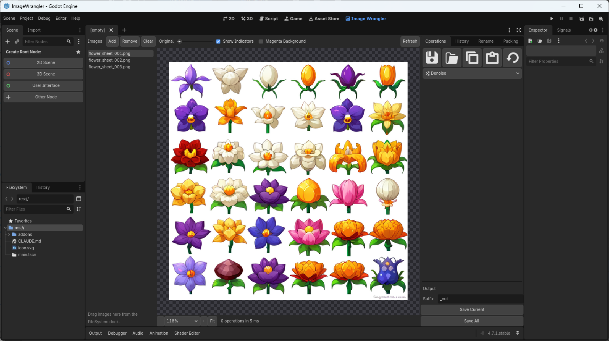
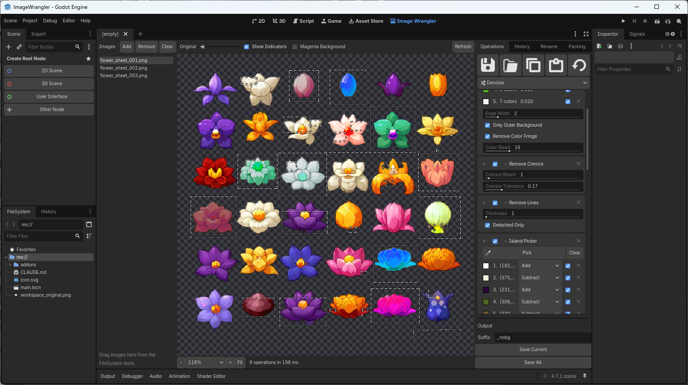
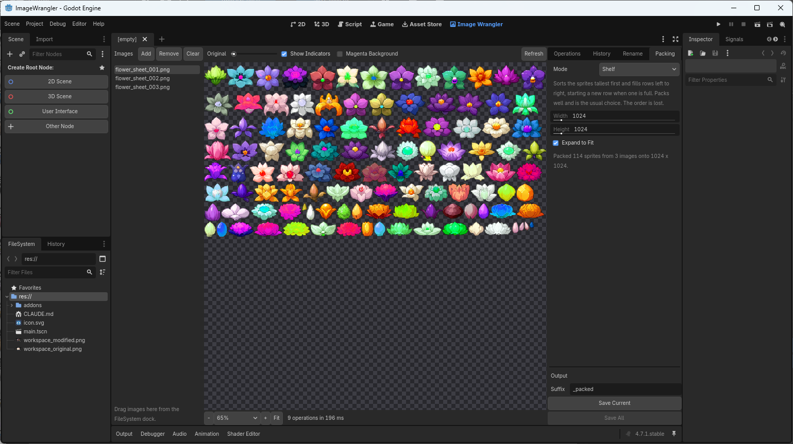

# 🖼️ Image Wrangler

<p>
  
  
  
  
  
</p>

> ### 🤖 A note before anything else
> **Claude was used extensively to build this addon.** The code, the comments and this
> README were written with heavy help from Anthropic's Claude.

---

## 🌸 What it is

Image Wrangler is a **whole editor tab** inside Godot — sitting next to 2D, 3D and Script —
for cleaning up images without leaving the engine. Load a pile of files, stack up a few
operations, watch the result live at 800% zoom, and write the finished files back out.

**🎯 The thing it was built for: cleaning up AI-generated sprite sheets.** Image generators
hand you a grid of lovely sprites glued to a flat white background, with JPEG mush around
every edge, faint halos, speckles, and hairline rules between the cells. Getting that into
a game means cutting each sprite out cleanly — and a plain colour-key leaves you either a
white fringe or a chewed-up silhouette.

**🧰 It is not only for AI images, though.** Nothing in here knows or cares where a picture
came from. Scans, screenshots, photographed artwork, old assets with a background baked in —
same tools, same results.

---

## 📸 Screenshots

**Before** — three AI-made flower sheets, backgrounds and all:



**After** — background gone, edges kept soft, a few regions fixed by hand:



**Packed** — every flower lifted off all three sheets and laid onto one atlas:



---

## ✨ What it can do

Operations are stacked. You add the ones an image actually needs, drag them into the order
you want, and they run as one pass — so a stage never sees a half-finished image.

### 🔵 Repair — fix the pixels before anything reads them

| | Operation | What it does |
|:--|:--|:--|
| 🌫️ | **Denoise** | Runs Intel Open Image Denoise over the source. Lifts grain and JPEG mosquito noise while leaving edges where it found them. |
| ▦ | **Smooth Blocks** | Flattens the 8×8 grid a JPEG leaves behind. |
| 🎨 | **Smooth Color** | Flattens colour while leaving brightness alone, fixing colour smeared sideways past every edge. |
| 〰️ | **Smooth Halos** | Flattens the faint ripples a JPEG leaves beside a hard edge. |

### 🟠 Color — move the colours around

| | Operation | What it does |
|:--|:--|:--|
| 🎚️ | **HSV Adjust** | Pick rectangles off the preview; each gets its own hue, saturation and value sliders. Regions may overlap. |
| 🎲 | **Random HSV Tiles** | Finds every separate object on its own and gives each one a random colour. Forty flowers, forty palettes, one click. |

### 🟣 Background — take the background out

| | Operation | What it does |
|:--|:--|:--|
| 🧽 | **Remove Background** | The main event. Recovers real per-pixel coverage from an antialiased edge instead of thresholding it away, so the silhouette stays soft rather than fringed or jagged. |
| 📐 | **Remove Crevice** | Squeezes background into nooks too narrow for the flood fill to have reached. |

### 🟡 Edges — clean up the silhouette it left

| | Operation | What it does |
|:--|:--|:--|
| 🪶 | **Refine Edges** | A guided filter that tidies the alpha while following the picture's own edges. No softening. |
| ✏️ | **Edge Cleanup** | Restores antialiasing on an edge that came back hard, and can outline it. |

### 🟢 By Hand — for what the maths can't name

| | Operation | What it does |
|:--|:--|:--|
| 🖌️ | **Brush Edit** | Paint alpha up or down along strokes dragged over the preview. |
| 🎯 | **Island Picker** | Click a region to remove or protect it, one at a time. For patches no colour rule can single out. |
| 🔺 | **Polygon Edit** | Draw a shape and force it transparent or opaque, whatever's inside it. Good for watermarks and scan edges. |

### 🔴 Cleanup — tidy what's left

| | Operation | What it does |
|:--|:--|:--|
| 🪣 | **Fill Pinholes** | Closes small transparent specks inside a subject, painting each one to match its surroundings. |
| ➖ | **Remove Lines** | Erases anything the silhouette is too thin to have earned — hairlines, scan borders, leftover grid rules, specks. |

---

## 📦 Batch tools

These three describe the **whole batch** rather than any one image, so they sit in their own
tabs beside the stack.

### 🏷️ Rename

Writes files out under new names, pixels untouched. Find-and-replace, a prefix, a base name,
a zero-padded counter with your own start and step, and a choice of which end the number goes on.

### 🧩 Packing

Lifts every separate object out of **every open image** and lays them all onto one sheet.

| Mode | Behaviour |
|:--|:--|
| 🟦 **Shelf** | Tallest first, filling rows left to right. The usual choice — packs well, order is lost. |
| 🟧 **Grid** | One cell per sprite, all cells the size of the largest. Wasteful, but frames land on a stride you can index by number. |
| 🟩 **Tight** | Each sprite dropped into the lowest gap that fits. Densest, least predictable. |
| 🟪 **Original Order** | Rows again, but in the order sprites were found. The only mode where the output order means something. |

The sheet can hold a size you've decided on, or double until everything fits.

### 🔍 Upscale

Enlarges **every open image** with a trained network, which invents the pixels rather than
stretching them. Runs on the GPU through Vulkan.

It works on what each image's **stack** produced, not on the file it came from — so a
background you keyed out is cut against edges the source actually had, rather than against
edges the network guessed at.

| Setting | What it does |
|:--|:--|
| ⚙️ **Engine** | [waifu2x](https://github.com/nihui/waifu2x-ncnn-vulkan) or [Real-ESRGAN](https://github.com/xinntao/Real-ESRGAN-ncnn-vulkan). waifu2x doubles and can denoise; Real-ESRGAN goes 2x–4x in one pass, invents more detail, and has no denoising. The settings below change with it. |
| 🧠 **Model** | Which trained network, from the engine's own set. Most are for drawn art, one of each is for photographs; the line under the dropdown says which is which. |
| 📐 **Scale** | 1x to 32x on waifu2x, which doubles — anything past 2x is that pass run again on its own output. On Real-ESRGAN, whichever ratios the model ships: 2x, 3x and 4x for `realesr-animevideov3`, and 4x only for the two `x4plus` models. |
| 🧹 **Denoise** | waifu2x only. Off, or four strengths. Off is a different model, not a strength of zero. |
| ✂️ **Sharpen** | Tightens the antialiasing round the object, where the transparency is partial. At 1 the edge is a hard cut. The object never changes size. |
| 🔄 **TTA Mode** | Runs each image eight ways and averages them. Eight times the work for a difference you have to look for. |

Alpha survives: it rides across on a bicubic resize beside the network, so a keyed sprite
comes out keyed. **Sharpen** is what tidies the ramp that leaves behind, and costs nothing to
adjust — it works on the finished picture, so moving it doesn't run the network again.

---

## 🛠️ Other things it does

- **👀 Live preview** — zoom from 1% to 1000%, wheel-zoom towards the cursor, drag to pan,
  fade the original back in over the result, and a magenta backdrop for spotting stray pixels.
- **↩️ Undo history** — every edit made to an image's stack this session, in a list. Click one
  to rewind to it.
- **💾 Settings sidecars** — each image's stack is saved next to it as `yourfile.iwc`, so
  reopening the project picks up where you left off. Older `yourfile_wrangler.json` sidecars
  are converted to the new form the first time their image is opened. Settings can also be
  copied between images or saved as a preset.
- **📥 Drag and drop** — drag images straight in from the FileSystem dock.
- **⚡ Fast** — the heavy pixel work is C++ running off the main thread, with a progress bar
  per stage so you can see which one is the slow one.
- **📄 Formats** — `png`, `jpg`, `jpeg`, `bmp`, `tga`, `webp`.

---

## 🚀 Installing

1. Copy the `addons/image_wrangler` folder into your project's `addons/` folder.
2. In Godot, open **Project → Project Settings → Plugins** and tick **Image Wrangler**.
3. An **Image Wrangler** tab appears next to 2D, 3D and Script. That's it.

### 📋 Requirements

- **Godot 4.7 or newer**
- **Windows x86_64** — that's what the prebuilt binaries in `addons/image_wrangler/bin/` are for.
  Other platforms need a build from source (`scons` in the addon folder, with the `godot-cpp`
  submodule checked out).
- **A Vulkan driver**, for the Upscale tab only. Without one it falls back to the processor
  and takes roughly a hundred times as long; the tab says so when it does. Nothing else here
  needs a GPU.

Building the extension yourself needs one extra step before `scons`, because the inference
library both upscalers run on ships as source rather than as binaries. That source is
committed here, so a plain clone already has it — nothing to fetch:

```
cd addons/image_wrangler
python tools/build_ncnn.py     # once, needs CMake
scons target=editor
```

Skip it and everything still builds — the Upscale tab is simply left out and says what to run.
See [`thirdparty/waifu2x-ncnn-vulkan/README-vendored.md`](addons/image_wrangler/thirdparty/waifu2x-ncnn-vulkan/README-vendored.md)
and [`thirdparty/realesrgan-ncnn-vulkan/README-vendored.md`](addons/image_wrangler/thirdparty/realesrgan-ncnn-vulkan/README-vendored.md).

---

## 📜 License

MIT — see [`addons/image_wrangler/LICENSE`](addons/image_wrangler/LICENSE).

Third-party components (Intel Open Image Denoise, oneTBB, waifu2x-ncnn-vulkan and
Real-ESRGAN-ncnn-vulkan with their trained models, ncnn, glslang, godot-cpp, and the editor
icon set) carry their own licenses, listed in
[`addons/image_wrangler/THIRD-PARTY-NOTICES.md`](addons/image_wrangler/THIRD-PARTY-NOTICES.md).
